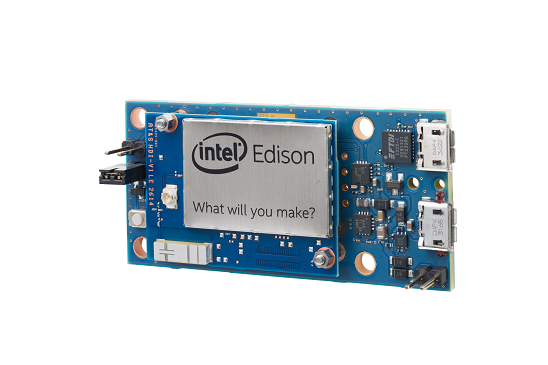

# QNAP QIoT Suite Lite 

This repository contains QIoT device SDKs. We provide sample code for enable connect client devices to QNAP QIoT Suite Lite. 

## QNAP QIoT device SDKs

The QNAP QIoT device SDKs contain code that facilitate building devices and applications that connect to and are managed by QNAP QIoT Suite services.

Devices and data sources in an IoT solution can range from a simple network-connected sensor to a powerful, standalone computing device. Devices may have limited processing capability, memory, communication bandwidth, and communication protocol support. The IoT device SDKs enable you to implement client applications for a wide variety of devices.

This repository contains the following QIoT device SDKs:

- QNAP QIoT device SDK for Arduino

- [QNAP QIoT device SDK for Node.js](nodejs/device/readme.md)

- [See Raspberry Device "helloworld" Example with Node.js](nodejs/device/examples/raspberry/mqtt_hello_world_simple_sample.js)

Each language SDK includes sample code and documentation in addition to the library code. The API reference documentation is coming soon.

### OS platforms and hardware compatibility

QNAP IoT device SDKs can be used with a broad range of OS platforms and devices. See OS Platforms and hardware compatibility.

### For Example

- **Arduino Yún**

- **Raspberry Pi A/B, Pi 2, Pi 3 Model B**

- **Intel® Edison**

- **LinkIt™ 7688 DUO**

## Samples

Within the repository, you can find various types of simple samples that can help you get started.
Below is a complete list of all these simple samples.
In addition to these simple samples, you can find a long list of [getting started guides](doc/set_out) that describe all the steps necessary to run the simple samples on a wide variety of devices and platforms.

- Arduino device SDK:
   - [DHT 11 Arduino C++ sample](c_c++/device/examples/arduino/yun/QIOT-DHT11-MQTT-Demo.ino): Gives a tip to connect to QIoT broker service using MQTT protocol with DHT 11 sensor.

- Node.js device SDK:
   - [Simple Node.js sample - Raspberry](nodejs/device/examples/raspberry/mqtt_temperaturesensor_and_LED_simple_sample.js): Shows how to connect to QIoT message broker service in both send and receive messages using the MQTT protocol with 1 temperature sensor and 2 LEDs By using Raspberry Pi develop board.

## Contribution, feedback and issues

If you would like to become an active contributor to this project please follow the instructions provided in the contribution guidelines.
If you encounter any bugs or have suggestions for new features, please file an issue in the [Issues](https://github.com/QNAP/qnap-iot-sdks/issues) section of the project.

## Support

If you are having issues using one of the packages or using the QNAP QIoT Suite service that go beyond simple bug fixes or help requests that would be dealt within the [issues section](https://github.com/qnap-dev/qnap-qiot-sdks/issues) of this project, the Microsoft Customer Support team will try and help out on a best effort basis.
To engage Microsoft support, you can create a support ticket directly from the [QNAP portal](https://www.qnap.com).
Here is what you can expect Microsoft Support to be able to help with:
* **Client SDKs issues**: If you are trying to compile and run the libraries on a supported platform, the Support team will be able to assist with troubleshooting or questions related to compiler issues and communications to and from the QIoT Suite.  They will also try to assist with questions related to porting to an unsupported platform, but will be limited in how much assistance can be provided.  The team will be limited with trouble-shooting the hardware device itself or drivers and or specific properties on that device. 
* **QIoT container / Connectivity Issues**: Communication from the device client to the QNAP QIoT Suite service and communication from the QNAP QIoT Suite service to the client.  Or any other issues specifically related to the QNAP QIoT Suite.
* **Portal Issues**: Issues related to the portal, that includes access, security, dashboard, devices, Alarms, Usage, Settings and Actions.
* **REST/API Issues(Coming soon)**: Using the QIoT Suite REST/APIs that are documented in the documentation.

## Additional resources

In addition to the language SDKs, this repository ([qnap-qiot-sdks](https://github.com/qnap-dev/qnap-qiot-sdks)) contains the following folders:

### /build

This folder contains various build scripts to build the libraries.

### /doc

This folder contains the following documents that are relevant to all the language SDKs:

-  How to set up your device environment and define your device's sensor then send the data to QIoT container services.
- (Coming soon) Set up QIoT container describes how to configure your QNAP QIoT container service.
- (Coming soon) Manage QIoT container describes how to provision devices in your QNAP QIoT container service.
- FAQ contains frequently asked questions about the SDKs and libraries.
- (Coming soon) OS Platforms and hardware compatibility describes the SDK compatibility with different OS platforms as well as specific device configurations.

### /tools(Coming soon)

This folder contains tools you will find useful when you are working with QIoT container and the device SDKs.
